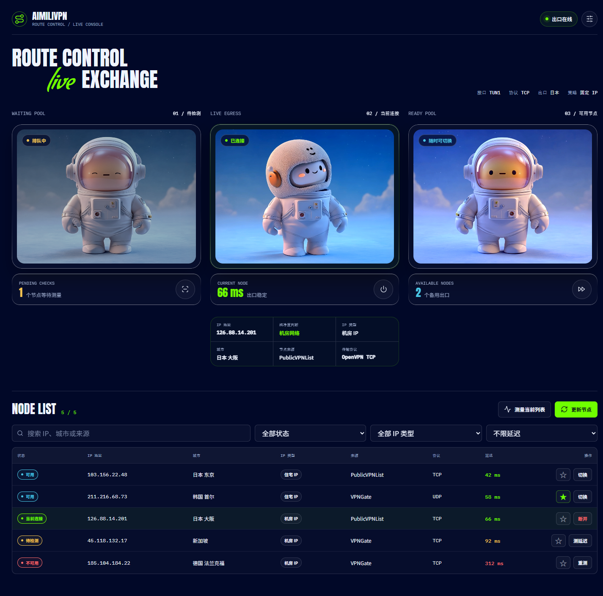
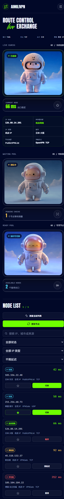

# AimiliVPN Enhanced

[中文](#中文) | [English](#english)

> [!IMPORTANT]
> 本项目基于 [baoweise-bot/aimili-vpngate](https://github.com/baoweise-bot/aimili-vpngate) 二次开发。衷心感谢原作者 `baoweise-bot` 及所有上游贡献者。本仓库是独立维护的衍生版本，不是上游官方项目，也不代表上游作者认可或支持本版本。

## 中文

AimiliVPN Enhanced 是部署在 Linux VPS 上的 OpenVPN 出口管理与 HTTP/SOCKS5 代理网关。它统一管理 VPNGate 和 PublicVPNList 节点，通过轻量延迟探测、双 TUN 隧道、连接排空和异步任务降低测速与切换时的等待和卡顿。

### 界面预览



<details>
<summary>查看移动端长截图</summary>



</details>

界面顶部的三个动画状态对应完整节点流程：

| 区域 | 含义 | 常用操作 |
| --- | --- | --- |
| 左侧：待检测节点 | 已获取但尚未完成延迟检测的候选节点 | 批量测量待检测节点 |
| 中间：当前连接 | 正在承载代理流量的活动 OpenVPN 出口 | 查看出口 IP、纯净度、IP 类型、城市、来源和协议；断开连接 |
| 右侧：可用节点 | 已通过检测、可以切换的节点 | 一键切换最低延迟节点 |
| 下方：节点列表 | 当前节点全集及筛选结果 | 搜索、按状态/IP 类型/延迟筛选、测速、收藏、切换 |

### 二次开发新增功能

- VPNGate 与 PublicVPNList 双来源，可分别使用或合并。
- 同时支持 OpenVPN TCP、UDP 配置；WireGuard 配置不能直接作为 OpenVPN 配置使用。
- 不启动完整隧道即可并发探测候选端点延迟。
- `tun0`/`tun1` 双槽位 make-before-break：新出口验证成功后才替换旧出口。
- 旧代理连接继续使用排空隧道，直到自然结束或达到超时。
- 切换 API 立即返回任务 ID，前端轮询状态，不阻塞页面。
- 智能自动、固定国家、固定 IP、仅收藏四种路由策略。
- 国家、来源、TCP/UDP、速度、延迟、纯净度、验证和可下载性筛选。
- 展示出口 IP、城市、来源、住宅/机房类型和可用的 IP 质量信号。
- `.ovpn` 按需下载，后台定时清理无效、孤立、过期和遗留测试配置。
- 管理面板重构，账号、密码、安全路径、管理端口和代理端口均可配置。

### 架构

```text
VPNGate -----------\
                    > 节点标准化 -> 并发延迟探测 -> 策略筛选
PublicVPNList -----/                              |
                                                    v
                                          候选隧道 tun0/tun1
                                                    |
                                      验证真实出口后原子切换
                                                    |
                                      HTTP/SOCKS5 127.0.0.1:7928
```

主要模块：

| 文件 | 职责 |
| --- | --- |
| `vpngate_manager.py` | 管理 API、节点编排、OpenVPN 生命周期、策略和后台任务 |
| `vpn_sources.py` | 节点来源适配、标准化、筛选、分页缓存和配置下载 |
| `tunnel_slots.py` | 活动/候选/排空双隧道状态 |
| `proxy_server.py` | HTTP/SOCKS5 代理和按连接绑定出口 |
| `config_cleanup.py` | 有界 `.ovpn` 缓存及受保护节点清理策略 |
| `webui/` | 重构后的管理界面 |

实现细节见 [BACKEND_ARCHITECTURE.md](BACKEND_ARCHITECTURE.md)。

### 安装

要求：Linux VPS、root 权限、Python 3、OpenVPN，以及可用的 `/dev/net/tun`。容器或 VPS 套餐若没有 TUN 权限，程序无法建立 OpenVPN 隧道。

```bash
bash <(curl -Ls https://raw.githubusercontent.com/wynx1123/aimili-vpngate/main/install.sh)
```

安装器默认执行以下操作：

1. 将程序安装到 `/opt/aimilivpn`。
2. 安装运行依赖并创建 `aimilivpn.service`。
3. 生成随机管理用户名、密码和 12 位安全路径；交互式安装时也可自定义。
4. 默认使用管理端口 `8787`、本地代理端口 `7928`。
5. 启动服务，获取节点并尝试建立第一个出口。

安装结束会显示类似下面的信息，请立即保存在密码管理器中：

```text
网页控制面板: http://SERVER_IP:8787/SECURE_PATH/
网页管理账号: GENERATED_USERNAME
网页管理密码: GENERATED_PASSWORD
HTTP/SOCKS5:  127.0.0.1:7928
```

安全路径不是 API Token，但它是管理入口的一部分。不要把真实账号、密码、安全路径或 `.ovpn` 配置提交到公开仓库。

### 第一次登录

1. 在 VPS 防火墙或云安全组中仅向可信来源开放管理端口 `8787`。
2. 打开 `http://SERVER_IP:8787/SECURE_PATH/`，末尾 `/` 建议保留。
3. 输入安装器生成的用户名和密码。
4. 登录后点击右上角设置，可修改管理员账号、密码、管理端口和安全路径。
5. 修改管理端口或安全路径会重启管理服务，并跳转到新地址；修改账号或密码会使旧会话失效。

忘记凭据时，在 VPS 终端运行：

```bash
ml status
ml password
```

`ml status` 会显示当前面板地址和配置状态；`ml password` 可重新设置账号密码。也可运行 `ml` 打开交互式管理菜单。

### 面板使用流程

#### 1. 获取与刷新节点

点击“更新节点”。后台会按当前来源和筛选条件刷新节点，前端立即返回，不需要停留等待。状态栏显示维护进度，完成后列表自动更新。

#### 2. 测量延迟

- “测量待检测”仅检测等待池。
- “测量当前列表”检测当前搜索和筛选结果。
- 单个节点可点击“测延迟”或“重测”。
- 后端单次最多接收 100 个节点，前端也会按此上限提交。

延迟表示 VPS 到 OpenVPN 端点的轻量探测结果，不等同于完整隧道吞吐、目标网站延迟或节点长期稳定性。

#### 3. 切换、断开和收藏

- 可用节点点击“切换”：后台先创建候选隧道，验证出口成功后再切流量。
- “切换最快”：从当前可用节点中选最低探测延迟节点。
- 点击星标收藏节点；“仅收藏”策略只会在收藏集合中选择。
- “断开”会关闭活动 OpenVPN 出口并暂停自动连接，直到再次手动连接节点。

切换不是零耗时。OpenVPN 握手、路由配置和出口验证仍需要数秒，但异步 API 会保持页面可操作，旧隧道也会继续承载既有连接。

#### 4. 路由策略

在“设置 -> 出站路由”中选择：

| 模式 | 行为 |
| --- | --- |
| 智能自动 `auto` | 在满足来源、筛选和 IP 类型条件的健康节点中自动选择与恢复 |
| 固定国家 `fixed_region` | 只使用指定国家的节点；该国全部失效时不会跨国回退 |
| 固定 IP `fixed_ip` | 先连接选定节点，再锁定该节点；节点失效时保持失败状态，不自动换 IP |
| 仅收藏 `favorites` | 只在收藏节点中选择；收藏为空或全部失效时不会使用非收藏节点 |

路由还可限制 IP 类型为全部、住宅或机房。IP 类型和纯净度来自第三方信号，只能用于辅助筛选，不是身份、安全性或合法性的证明。

#### 5. 节点来源与筛选

在“设置 -> 节点来源”中配置：

| 字段 | 可选值/说明 |
| --- | --- |
| 节点目录 | `vpngate`、`publicvpnlist`、`all` |
| PublicVPNList 提供方 | 空值表示全部；选项由来源 API 动态获取 |
| 国家 | 国家名称或代码，留空表示不限 |
| 协议 | TCP、UDP 或不限 |
| 最低速度 | `0` 表示不限，单位 Mbps |
| 最大延迟 | `0` 表示不限，单位 ms |
| IP 纯净度 | 任意、住宅、机房或未发现代理特征 |
| 仅已验证 | 只保留来源标记为已验证的节点 |
| 仅可下载 | 只保留能够取得 OpenVPN 配置的节点，默认开启 |

保存后筛选条件立即持久化，并在后台启动节点刷新。若已有维护任务，条件会在该任务结束后生效。

### 调用代理

代理默认仅监听 VPS 本机 `127.0.0.1:7928`，HTTP 和 SOCKS5 共用一个端口。推荐通过 SSH 隧道、同机程序或受控内网调用，不要直接暴露为无认证公网代理。

HTTP 代理：

```bash
curl -x http://127.0.0.1:7928 https://api.ipify.org
```

SOCKS5 代理，并让代理端解析域名：

```bash
curl --proxy socks5h://127.0.0.1:7928 https://api.ipify.org
```

Python `requests`：

```python
import requests

proxies = {
    "http": "http://127.0.0.1:7928",
    "https": "http://127.0.0.1:7928",
}

response = requests.get("https://api.ipify.org?format=json", proxies=proxies, timeout=20)
print(response.json())
```

环境变量：

```bash
export HTTP_PROXY=http://127.0.0.1:7928
export HTTPS_PROXY=http://127.0.0.1:7928
curl https://api.ipify.org
```

修改代理端口：在面板“设置 -> 代理网络”中填写 `1024-65535` 的端口，且不能与管理端口相同。端口变化会触发服务重启。

### 调用管理 API

API 适合自有自动化和受控运维。所有 URL 都必须包含安全路径；除登录外均需携带登录返回的 `session` Cookie。

先设置变量。以下均为占位符，不要把真实凭据写进脚本仓库：

```bash
BASE_URL="http://SERVER_IP:8787/SECURE_PATH"
COOKIE_JAR="./aimili-session.cookies"
```

#### 登录并保存会话

```bash
curl -sS -c "$COOKIE_JAR" \
  -H 'Content-Type: application/json' \
  -d '{"username":"ADMIN_USERNAME","password":"ADMIN_PASSWORD"}' \
  "$BASE_URL/api/login"
```

会话 Cookie 默认有效期为 30 天，服务重启后内存中的会话会失效，需要重新登录。

#### 查询状态与节点

```bash
curl -sS -b "$COOKIE_JAR" "$BASE_URL/api/state"
curl -sS -b "$COOKIE_JAR" "$BASE_URL/api/node_source_options"
curl -sS -b "$COOKIE_JAR" "$BASE_URL/api/v2/nodes?page=1&page_size=50"
```

`page_size` 范围为 `1-100`。节点列表不会返回完整 `config_text`。

#### 测量延迟

```bash
curl -sS -b "$COOKIE_JAR" \
  -H 'Content-Type: application/json' \
  -d '{"ids":["NODE_ID_1","NODE_ID_2"]}' \
  "$BASE_URL/api/v2/latency"
```

单次最多 100 个节点。响应的 `results` 包含各节点探测结果。

#### 异步连接与轮询

```bash
curl -sS -b "$COOKIE_JAR" \
  -H 'Content-Type: application/json' \
  -d '{"id":"NODE_ID"}' \
  "$BASE_URL/api/connect_async"

# 每 1 秒读取一次，直到 state.is_connecting=false，随后检查活动节点和提示信息
curl -sS -b "$COOKIE_JAR" "$BASE_URL/api/state"
```

连接提交成功返回 HTTP `202` 和 `job_id`。当前已有连接/维护任务时可能返回 `409`；节点 ID 无效时返回 `400`。

#### 更新来源筛选

```bash
curl -sS -b "$COOKIE_JAR" \
  -H 'Content-Type: application/json' \
  -d '{
    "node_source":"all",
    "filter_source":"",
    "filter_country":"Japan",
    "filter_protocol":"tcp",
    "min_speed_mbps":10,
    "max_latency_ms":250,
    "ip_purity":"any",
    "only_verified":false,
    "only_downloadable":true
  }' \
  "$BASE_URL/api/update_node_filters"
```

#### 更新路由策略

```bash
curl -sS -b "$COOKIE_JAR" \
  -H 'Content-Type: application/json' \
  -d '{
    "routing_mode":"fixed_region",
    "force_country":"Japan",
    "routing_ip_type":"all"
  }' \
  "$BASE_URL/api/update_routing"
```

`routing_mode` 可为 `auto`、`fixed_region`、`fixed_ip`、`favorites`。API 的 `fixed_ip` 模式锁定当前已连接节点，因此自动化流程应先调用 `connect_async`，确认连接完成后再调用 `update_routing`。

#### 收藏、断开和退出

```bash
curl -sS -b "$COOKIE_JAR" -H 'Content-Type: application/json' \
  -d '{"id":"NODE_ID"}' "$BASE_URL/api/toggle_favorite"

curl -sS -b "$COOKIE_JAR" -X POST "$BASE_URL/api/disconnect"
curl -sS -b "$COOKIE_JAR" -X POST "$BASE_URL/api/logout"
```

常用接口：

| 方法 | 路径 | 用途 |
| --- | --- | --- |
| POST | `/api/login` | 登录并设置会话 Cookie |
| GET | `/api/state` | 当前连接、路由、筛选和维护状态 |
| GET | `/api/node_source_options` | 来源目录、协议和提供方选项 |
| GET | `/api/v2/nodes` | 分页读取节点 |
| POST | `/api/refresh_nodes` | 后台刷新节点 |
| POST | `/api/update_node_filters` | 保存来源和筛选条件 |
| POST | `/api/update_routing` | 保存路由策略 |
| POST | `/api/v2/latency` | 批量轻量延迟探测 |
| POST | `/api/connect_async` | 异步切换节点 |
| POST | `/api/disconnect` | 断开并暂停自动连接 |
| POST | `/api/toggle_favorite` | 收藏或取消收藏节点 |
| POST | `/api/update_settings` | 更新代理端口及路由设置 |
| POST | `/api/update_credentials` | 更新管理账号、密码、端口和安全路径 |
| POST | `/api/logout` | 注销当前会话 |

### 运维命令

```bash
ml                 # 交互式管理菜单
ml status          # 状态、面板地址、隧道和代理概览
ml logs            # 实时服务日志
ml start           # 启动服务
ml stop            # 停止服务
ml restart         # 重启服务
ml web             # 修改网页管理设置
ml port            # 修改端口
ml password        # 修改管理员账号密码
ml update          # 从发布源更新
ml uninstall       # 完全卸载
```

常用 systemd 命令：

```bash
systemctl status aimilivpn --no-pager
journalctl -u aimilivpn -n 200 --no-pager
```

### 配置与清理

运行配置保存在 `/opt/aimilivpn/vpngate_data/`，其中可能包含管理凭据、状态、节点缓存和 `.ovpn` 文件。不要公开该目录。

| 环境变量 | 默认值 | 说明 |
| --- | ---: | --- |
| `NODE_SOURCE` | `vpngate` | 初始来源：`vpngate`、`publicvpnlist`、`all` |
| `LOCAL_PROXY_HOST` | `127.0.0.1` | 代理监听地址 |
| `LOCAL_PROXY_PORT` | `7928` | HTTP/SOCKS5 共用端口 |
| `UI_PORT` | `8787` | 管理界面初始端口 |
| `BACKGROUND_TEST_NODE_LIMIT` | `15` | 后台单轮完整测试上限 |
| `LATENCY_PROBE_WORKERS` | `10` | 并发延迟探测数 |
| `TUNNEL_DRAIN_SECONDS` | `45` | 旧隧道最短排空时间 |
| `TUNNEL_DRAIN_MAX_SECONDS` | `180` | 旧隧道最长排空时间 |
| `CONFIG_CLEANUP_INITIAL_DELAY_SECONDS` | `60` | 启动后首次清理延迟 |
| `CONFIG_CLEANUP_INTERVAL_SECONDS` | `3600` | 清理周期，默认每小时 |
| `CONFIG_MAX_FILES` | `300` | `.ovpn` 缓存文件上限 |
| `CONFIG_MAX_AGE_SECONDS` | `259200` | 普通配置最长缓存时间，默认 3 天 |

清理任务会删除：1 小时以上的遗留测试配置、30 分钟以上的无效节点配置、6 小时以上的孤立配置、3 天以上的普通缓存，以及超过 300 个后的最旧缓存。活动隧道、排空隧道、固定 IP 节点和收藏节点配置会被保护。被删除的 PublicVPNList 配置在下次测速、连接或下载时可按需重新获取，因此文件“重新出现”属于正常行为。

### 常见问题 / 问答

#### Q1：为什么安装后无法连接，提示 TUN 不可用？

检查 `ls -l /dev/net/tun`。如果不存在，需要在 VPS/容器控制面板开启 TUN/TAP 或让提供商授权。仅安装 OpenVPN 软件不能补足宿主机缺失的内核权限。

#### Q2：为什么打不开管理面板？

确认使用完整地址 `http://SERVER_IP:PORT/SECURE_PATH/`，并检查 `ml status`、`ml logs`、云安全组和 VPS 防火墙。直接访问 IP 根路径或错误安全路径会返回 404，这是预期保护行为。

#### Q3：API 为什么返回 401 或 404？

`404` 通常是 URL 缺少或写错安全路径；`401` 表示没有有效 `session` Cookie。先调用登录接口并用 Cookie Jar 保存/携带 Cookie。服务重启或修改凭据后需要重新登录。

#### Q4：为什么列表没有节点？

先将来源设为 `all`，清空国家、提供方、协议、速度、延迟和纯净度限制，再点击更新节点。随后查看 `ml logs`，确认 VPS 能访问数据来源和配置下载地址。

#### Q5：OpenVPN TCP、UDP 和 WireGuard 是什么关系？

本项目当前连接核心是 OpenVPN，可使用来源提供的 OpenVPN TCP 或 UDP 配置。WireGuard 是另一种协议，不能读取 `.ovpn` 文件，也不能把 OpenVPN TCP 配置直接转换成 WireGuard。未来接入 WireGuard 来源需要独立适配器、配置模型和隧道驱动。

#### Q6：为什么切换仍需要几秒？

“丝滑”指页面异步响应、旧连接不中断，以及新隧道验证后再切换，不代表跳过 OpenVPN TLS 握手、路由设置和出口检测。节点质量、VPS 网络、TCP/UDP 传输和远端负载都会影响完成时间。

#### Q7：固定国家或固定 IP 失效后会自动换吗？

固定国家只会在同一国家内恢复，不会跨国；固定 IP 不会换到其他 IP；仅收藏不会回退到非收藏节点。需要更强可用性时使用智能自动模式。

#### Q8：可以把 `7928` 直接开放到公网吗？

不建议。当前代理入口不是面向公网滥用场景设计的完整认证网关。优先绑定 `127.0.0.1`，通过 SSH 隧道、VPN 内网或严格来源防火墙访问，并增加审计、速率限制和滥用控制。

#### Q9：删除过的 `.ovpn` 文件为什么又出现？

配置采用按需缓存。节点被重新测速、连接或显式下载时会再次获取配置。清理控制的是磁盘上限和过期文件，不会永久禁用该节点。

#### Q10：截图里的 IP、类型和纯净度能否当作安全证明？

不能。截图仅展示界面能力，节点 IP 也可能已变化。IP 地理位置、住宅/机房分类和纯净度来自外部信号，可能不完整或过期。

#### Q11：为什么界面会请求外部字体、图标或动画？

当前界面可从 Google Fonts、unpkg 和远程 CDN 加载资源，这会向提供方暴露访客 IP、浏览器元数据和 Referrer。生产环境如有隐私、合规或稳定性要求，应自行托管或移除这些资源，并确认动画素材授权。详见 [THIRD_PARTY_NOTICES.md](THIRD_PARTY_NOTICES.md)。

### 测试

```bash
python -m unittest discover -s tests
python -m py_compile vpngate_manager.py proxy_server.py vpn_sources.py \
  tunnel_slots.py vpn_utils.py config_cleanup.py
```

### 鸣谢、合规与许可证

- 原始项目：[baoweise-bot/aimili-vpngate](https://github.com/baoweise-bot/aimili-vpngate)
- 原作者及核心贡献者：[`baoweise-bot`](https://github.com/baoweise-bot)
- 二次开发维护者：[`wynx1123`](https://github.com/wynx1123)
- OpenAI ChatGPT / Codex 作为 AI 工具参与架构分析、部分实现、测试和中英文文档整理；AI 不是版权所有者、许可证授予者或法律责任主体。

仅在当地法律允许、且你有权使用的网络和设备上部署。禁止用于未授权访问、凭据攻击、恶意扫描、垃圾流量、侵权分发或其他违法活动。公共 VPN 出口由第三方运营，应视为不可信网络；敏感信息必须使用端到端加密。

本项目继承上游的 **GNU GPL v3 or later**。GPL 允许商业使用，因此衍生版本不能追加具有法律约束力的“禁止商业使用”限制。维护者不提供商业部署、代理转售或付费节点服务的授权、担保和支持；这是项目立场，不是对 GPL 权利的额外限制。

详见 [CONTRIBUTORS.md](CONTRIBUTORS.md)、[NOTICE.md](NOTICE.md)、[LEGAL.md](LEGAL.md)、[THIRD_PARTY_NOTICES.md](THIRD_PARTY_NOTICES.md) 和 [LICENSE](LICENSE)。

---

## English

AimiliVPN Enhanced is an independently maintained OpenVPN egress manager and HTTP/SOCKS5 proxy gateway for Linux VPS hosts. It combines VPNGate and PublicVPNList nodes and reduces UI stalls and connection disruption with lightweight probes, dual TUN slots, connection draining, and asynchronous switching jobs.

### UI preview


<details>
<summary>View the mobile dashboard</summary>


</details>

The three animated stages represent the node lifecycle:

| Stage | Meaning | Main actions |
| --- | --- | --- |
| Pending pool | Candidates that have not completed latency probing | Measure pending nodes |
| Current connection | The OpenVPN exit carrying proxy traffic | Inspect IP, quality, type, city, source, and protocol; disconnect |
| Available nodes | Verified candidates ready for switching | Switch to the lowest-latency candidate |
| Node list | All loaded nodes and the current filtered view | Search, filter, probe, favorite, and switch |

### Features added by this derivative

- VPNGate and PublicVPNList catalogs, independently selectable or combined.
- OpenVPN TCP and UDP profiles. WireGuard profiles are not interchangeable with OpenVPN profiles.
- Concurrent endpoint probes without starting a full tunnel for every candidate.
- `tun0`/`tun1` make-before-break switching with egress verification.
- Connection draining so existing clients can finish on the previous tunnel.
- An asynchronous connection API that keeps the dashboard responsive.
- Automatic, fixed-country, fixed-IP, and favorites-only routing.
- Country, provider, protocol, speed, latency, IP-quality, verification, and downloadability filters.
- Exit IP, city, source, residential/datacenter type, and available quality signals.
- Lazy `.ovpn` downloads and scheduled bounded cache cleanup.
- A redesigned management UI with administrator, secure-path, UI-port, and proxy-port settings.

### Architecture

```text
VPNGate -----------\
                    > normalization -> concurrent probes -> policy filters
PublicVPNList -----/                                      |
                                                            v
                                                   tun0/tun1 candidate
                                                            |
                                                verify, then atomic switch
                                                            |
                                           HTTP/SOCKS5 127.0.0.1:7928
```

See [BACKEND_ARCHITECTURE.md](BACKEND_ARCHITECTURE.md) for implementation details.

### Installation

Requirements: a Linux VPS, root access, Python 3, OpenVPN, and an available `/dev/net/tun` device.

```bash
bash <(curl -Ls https://raw.githubusercontent.com/wynx1123/aimili-vpngate/main/install.sh)
```

The installer deploys to `/opt/aimilivpn`, creates `aimilivpn.service`, generates a random administrator username/password and 12-character secure path, starts the service, fetches nodes, and attempts the first connection. Interactive installations can override the generated web settings.

Store the final output securely:

```text
Dashboard:  http://SERVER_IP:8787/SECURE_PATH/
Username:   GENERATED_USERNAME
Password:   GENERATED_PASSWORD
HTTP/SOCKS: 127.0.0.1:7928
```

The secure path is not an API token, but it is part of every dashboard and API URL. Never commit real credentials, secure paths, runtime data, or `.ovpn` profiles.

### First login

1. Allow management port `8787` only from trusted sources in the VPS firewall/security group.
2. Open `http://SERVER_IP:8787/SECURE_PATH/`.
3. Sign in with the generated credentials.
4. Use the settings drawer to change the account, password, UI port, secure path, and proxy port.
5. Changing the UI port or secure path restarts the service. Changing credentials invalidates existing sessions.

Run `ml status` to view current access information and `ml password` to reset credentials. Running `ml` opens the interactive menu.

### Dashboard workflow

1. **Update nodes:** starts a background refresh using the saved source filters.
2. **Measure latency:** probe the pending pool, visible list, or a single node. Requests are limited to 100 node IDs.
3. **Switch:** a candidate tunnel is established and verified before traffic moves; the request itself returns immediately.
4. **Favorite:** mark stable nodes for use with the favorites-only policy.
5. **Disconnect:** stop the active tunnel and pause automatic reconnection until a manual connection is made.

Probe latency is the VPS-to-endpoint result. It is not a guarantee of full-tunnel throughput, destination latency, uptime, or safety.

### Routing modes

| Mode | Behavior |
| --- | --- |
| Automatic `auto` | Selects and recovers among healthy nodes allowed by all filters |
| Fixed country `fixed_region` | Stays within one country and does not fall back across countries |
| Fixed IP `fixed_ip` | Connects to and pins one selected node; it does not silently change IP |
| Favorites only `favorites` | Selects only favorite nodes and does not fall back to other nodes |

Routing can also be limited to residential or datacenter IPs. These classifications are third-party signals, not proof of identity, legality, or security.

### Sources and filters

The source panel supports `vpngate`, `publicvpnlist`, or `all`; an optional PublicVPNList provider; country; TCP/UDP; minimum Mbps; maximum latency; IP-quality mode; verified-only; and downloadable-only. Zero speed/latency means no limit. Saving persists the filters and starts a background refresh, or queues them behind an already-running maintenance task.

### Using the proxy

HTTP and SOCKS5 share `127.0.0.1:7928` by default:

```bash
curl -x http://127.0.0.1:7928 https://api.ipify.org
curl --proxy socks5h://127.0.0.1:7928 https://api.ipify.org
```

Python:

```python
import requests

proxies = {
    "http": "http://127.0.0.1:7928",
    "https": "http://127.0.0.1:7928",
}

response = requests.get("https://api.ipify.org?format=json", proxies=proxies, timeout=20)
print(response.json())
```

Environment variables:

```bash
export HTTP_PROXY=http://127.0.0.1:7928
export HTTPS_PROXY=http://127.0.0.1:7928
curl https://api.ipify.org
```

Keep the proxy on loopback and reach it through a controlled private network or SSH tunnel. Do not expose it as an unauthenticated public proxy.

### Management API

Every API URL includes the secure-path prefix. All endpoints except login require the returned `session` cookie.

```bash
BASE_URL="http://SERVER_IP:8787/SECURE_PATH"
COOKIE_JAR="./aimili-session.cookies"

# Login
curl -sS -c "$COOKIE_JAR" -H 'Content-Type: application/json' \
  -d '{"username":"ADMIN_USERNAME","password":"ADMIN_PASSWORD"}' \
  "$BASE_URL/api/login"

# State, source options, and paginated nodes
curl -sS -b "$COOKIE_JAR" "$BASE_URL/api/state"
curl -sS -b "$COOKIE_JAR" "$BASE_URL/api/node_source_options"
curl -sS -b "$COOKIE_JAR" "$BASE_URL/api/v2/nodes?page=1&page_size=50"

# Probe up to 100 node IDs
curl -sS -b "$COOKIE_JAR" -H 'Content-Type: application/json' \
  -d '{"ids":["NODE_ID_1","NODE_ID_2"]}' "$BASE_URL/api/v2/latency"

# Start an asynchronous switch, then poll /api/state
curl -sS -b "$COOKIE_JAR" -H 'Content-Type: application/json' \
  -d '{"id":"NODE_ID"}' "$BASE_URL/api/connect_async"
curl -sS -b "$COOKIE_JAR" "$BASE_URL/api/state"
```

A successful async connection submission returns HTTP `202` and a `job_id`. Poll until `state.is_connecting` is false, then inspect `active_openvpn_node_id` and `last_check_message`. A conflicting maintenance/connection task can return `409`; an invalid node ID returns `400`.

Update source filters:

```bash
curl -sS -b "$COOKIE_JAR" -H 'Content-Type: application/json' \
  -d '{
    "node_source":"all",
    "filter_source":"",
    "filter_country":"Japan",
    "filter_protocol":"tcp",
    "min_speed_mbps":10,
    "max_latency_ms":250,
    "ip_purity":"any",
    "only_verified":false,
    "only_downloadable":true
  }' "$BASE_URL/api/update_node_filters"
```

Update routing:

```bash
curl -sS -b "$COOKIE_JAR" -H 'Content-Type: application/json' \
  -d '{
    "routing_mode":"fixed_region",
    "force_country":"Japan",
    "routing_ip_type":"all"
  }' "$BASE_URL/api/update_routing"
```

For `fixed_ip`, first connect the desired node and wait for success; the routing endpoint pins the currently connected node.

Additional calls:

```bash
curl -sS -b "$COOKIE_JAR" -H 'Content-Type: application/json' \
  -d '{"id":"NODE_ID"}' "$BASE_URL/api/toggle_favorite"
curl -sS -b "$COOKIE_JAR" -X POST "$BASE_URL/api/disconnect"
curl -sS -b "$COOKIE_JAR" -X POST "$BASE_URL/api/logout"
```

| Method | Endpoint | Purpose |
| --- | --- | --- |
| POST | `/api/login` | Create a cookie-backed session |
| GET | `/api/state` | Connection, routing, filtering, and maintenance state |
| GET | `/api/node_source_options` | Catalog, protocol, and provider options |
| GET | `/api/v2/nodes` | Paginated nodes, `page_size` 1-100 |
| POST | `/api/refresh_nodes` | Start a background refresh |
| POST | `/api/update_node_filters` | Persist source filters |
| POST | `/api/update_routing` | Persist routing policy |
| POST | `/api/v2/latency` | Probe up to 100 nodes |
| POST | `/api/connect_async` | Start a non-blocking node switch |
| POST | `/api/disconnect` | Disconnect and pause automatic connection |
| POST | `/api/toggle_favorite` | Add/remove a favorite |
| POST | `/api/update_settings` | Update proxy port and routing settings |
| POST | `/api/update_credentials` | Update account, password, UI port, and secure path |
| POST | `/api/logout` | End the current session |

### Operations

```bash
ml                 # Interactive menu
ml status          # Dashboard, tunnel, and proxy status
ml logs            # Live service logs
ml start           # Start
ml stop            # Stop
ml restart         # Restart
ml web             # Web settings
ml port            # Port settings
ml password        # Administrator credentials
ml update          # Update from the release source
ml uninstall       # Remove the installation
```

```bash
systemctl status aimilivpn --no-pager
journalctl -u aimilivpn -n 200 --no-pager
```

### Configuration cleanup

Runtime data lives in `/opt/aimilivpn/vpngate_data/` and can contain credentials, state, cache data, and profiles. Do not publish it.

| Variable | Default | Purpose |
| --- | ---: | --- |
| `NODE_SOURCE` | `vpngate` | Initial catalog: `vpngate`, `publicvpnlist`, or `all` |
| `LOCAL_PROXY_HOST` | `127.0.0.1` | Proxy bind address |
| `LOCAL_PROXY_PORT` | `7928` | Combined HTTP/SOCKS5 port |
| `UI_PORT` | `8787` | Initial dashboard port |
| `BACKGROUND_TEST_NODE_LIMIT` | `15` | Full background tests per round |
| `LATENCY_PROBE_WORKERS` | `10` | Concurrent endpoint probes |
| `TUNNEL_DRAIN_SECONDS` | `45` | Minimum old-tunnel drain time |
| `TUNNEL_DRAIN_MAX_SECONDS` | `180` | Maximum old-tunnel drain time |
| `CONFIG_CLEANUP_INITIAL_DELAY_SECONDS` | `60` | Delay before the first cleanup |
| `CONFIG_CLEANUP_INTERVAL_SECONDS` | `3600` | Cleanup interval, one hour |
| `CONFIG_MAX_FILES` | `300` | Maximum cached `.ovpn` files |
| `CONFIG_MAX_AGE_SECONDS` | `259200` | Normal profile lifetime, three days |

Cleanup removes abandoned test profiles after one hour, unavailable-node profiles after 30 minutes, orphaned profiles after six hours, ordinary profiles after three days, and the oldest unprotected files above the 300-file cap. Active, draining, fixed-IP, and favorite profiles are protected. A removed PublicVPNList profile may be downloaded again when the node is probed, connected, or explicitly downloaded.

### FAQ

#### Why does installation fail with an unavailable TUN device?

Check `ls -l /dev/net/tun`. Enable TUN/TAP in the VPS/container control panel or ask the provider. Installing OpenVPN cannot grant a container missing host-kernel permissions.

#### Why is the dashboard inaccessible?

Use the complete `http://SERVER_IP:PORT/SECURE_PATH/` URL. Check `ml status`, `ml logs`, the cloud security group, and the VPS firewall. The root URL and incorrect secure paths intentionally return 404.

#### Why does the API return 401 or 404?

`404` usually means the secure-path prefix is missing or incorrect. `401` means the `session` cookie is missing, expired, or invalidated. Log in again after a service restart or credential change.

#### Why are there no nodes?

Select `all`, remove restrictive country/provider/protocol/speed/latency/quality filters, update nodes, and inspect `ml logs`. Confirm that the VPS can reach the catalog and profile-download services.

#### Does this support OpenVPN TCP, UDP, and WireGuard?

It supports OpenVPN profiles using TCP or UDP. WireGuard is a separate protocol and cannot consume `.ovpn` files or transparently convert an OpenVPN TCP profile. WireGuard would require a separate source adapter, configuration model, and tunnel driver.

#### Why does switching still take several seconds?

Smooth switching means a responsive UI, preserved existing connections, and verification before cutover. It cannot skip OpenVPN TLS negotiation, route setup, or egress verification. Node load, VPS routing, and TCP/UDP behavior affect completion time.

#### Will fixed-country or fixed-IP routing fail over?

Fixed country recovers only within that country. Fixed IP does not change to another IP. Favorites-only does not use non-favorite nodes. Use automatic mode when availability matters more than identity stability.

#### Can port 7928 be exposed publicly?

That is not recommended. Keep it on `127.0.0.1` and use an SSH tunnel, private network, or strict source firewall plus authentication, monitoring, rate limiting, and abuse controls.

#### Why do deleted `.ovpn` files reappear?

Profiles are cached on demand. Probing, connecting, or downloading a node can materialize its profile again. Cleanup bounds disk use; it does not permanently disable nodes.

#### Are IP type, location, and quality definitive?

No. They are third-party, potentially incomplete or stale signals. They are not proof of identity, safety, legality, or current node ownership.

#### Why does the UI contact external CDNs?

It can load Google Fonts, Lucide from unpkg, and remote demonstration videos. Those requests may disclose IP, browser metadata, and referrer information. Self-host or remove them where privacy, reliability, or licensing requires it, and review [THIRD_PARTY_NOTICES.md](THIRD_PARTY_NOTICES.md).

### Tests

```bash
python -m unittest discover -s tests
python -m py_compile vpngate_manager.py proxy_server.py vpn_sources.py \
  tunnel_slots.py vpn_utils.py config_cleanup.py
```

### Credits, compliance, and license

- Upstream: [baoweise-bot/aimili-vpngate](https://github.com/baoweise-bot/aimili-vpngate)
- Original author and core contributor: [`baoweise-bot`](https://github.com/baoweise-bot)
- Derivative maintainer: [`wynx1123`](https://github.com/wynx1123)
- OpenAI ChatGPT / Codex assisted with architecture analysis, parts of the implementation, tests, and bilingual documentation. AI is not a copyright owner, licensor, or responsible legal party.

Deploy only where lawful and on networks and systems you are authorized to use. Do not use this project for unauthorized access, credential attacks, malicious scanning, spam, infringement, or other unlawful activity. Public VPN exits are untrusted third-party networks; use end-to-end encryption for sensitive data.

This derivative remains licensed under **GNU GPL v3 or later**. GPL permits commercial use, so the derivative cannot add a legally binding non-commercial restriction. The maintainers do not provide authorization, warranty, or support for commercial deployment, proxy resale, or paid node services. This is a project position, not an extra restriction on GPL rights.

See [CONTRIBUTORS.md](CONTRIBUTORS.md), [NOTICE.md](NOTICE.md), [LEGAL.md](LEGAL.md), [THIRD_PARTY_NOTICES.md](THIRD_PARTY_NOTICES.md), and [LICENSE](LICENSE).
